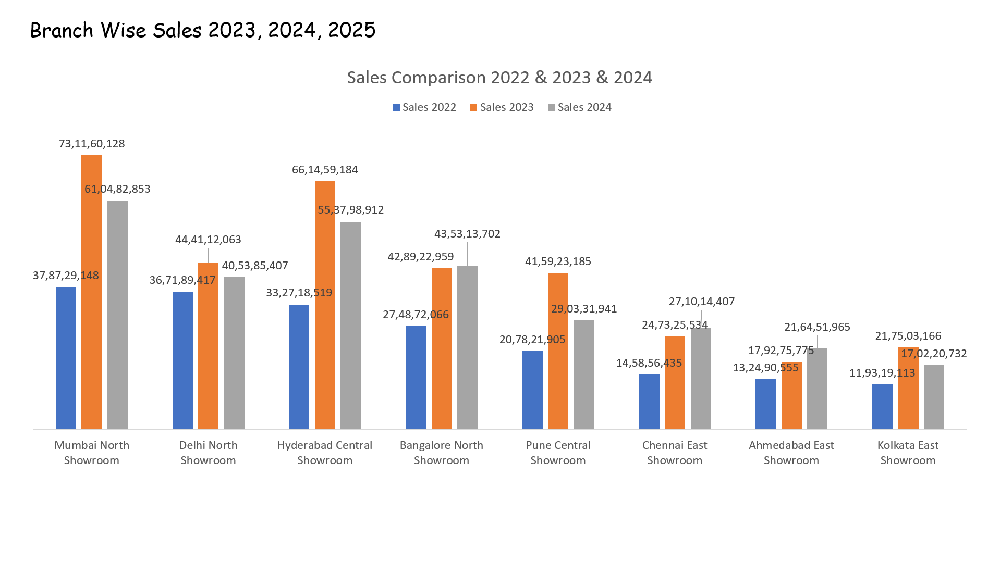
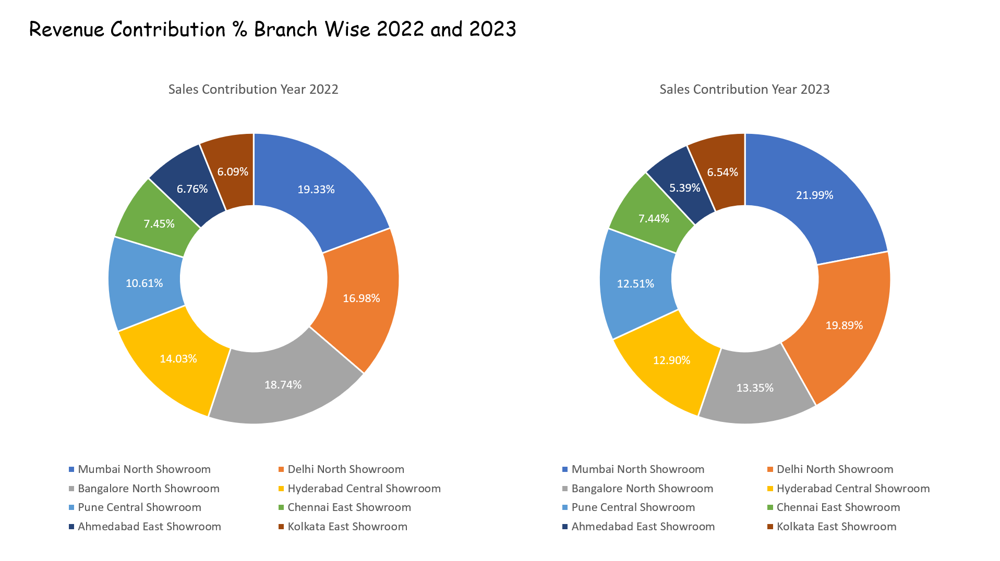
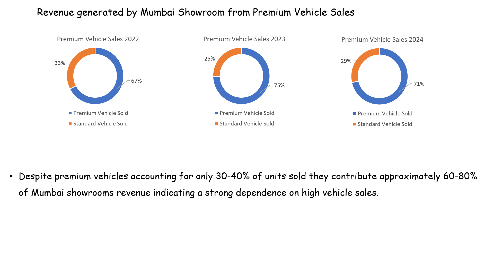
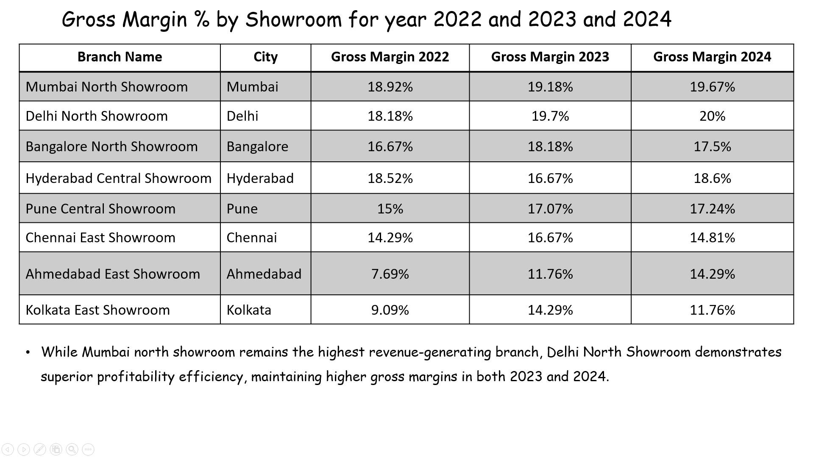
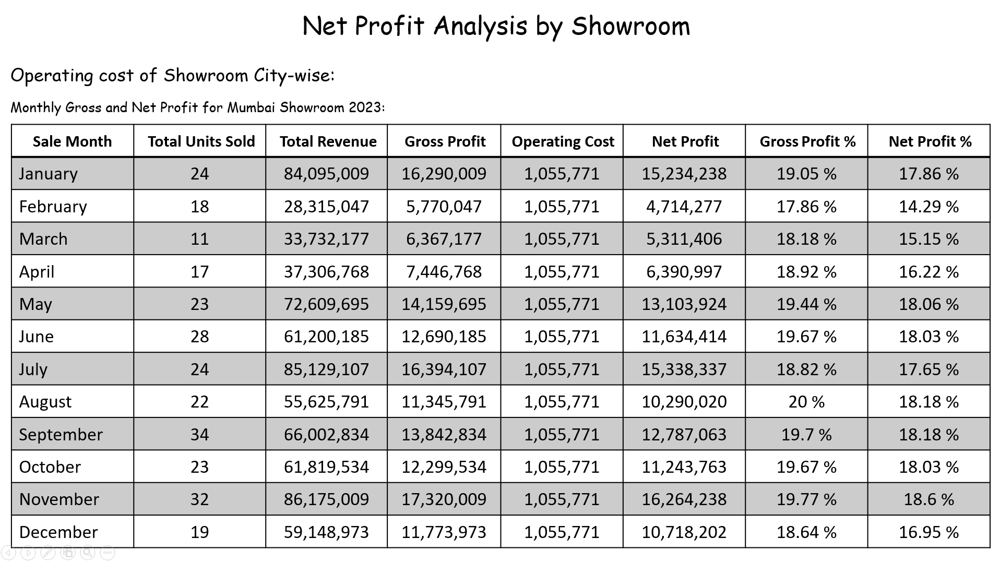
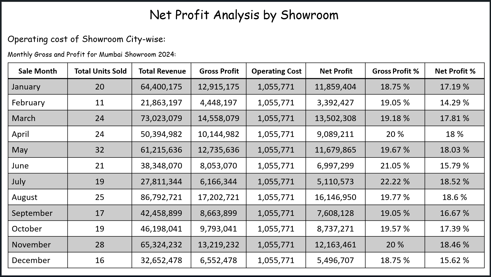
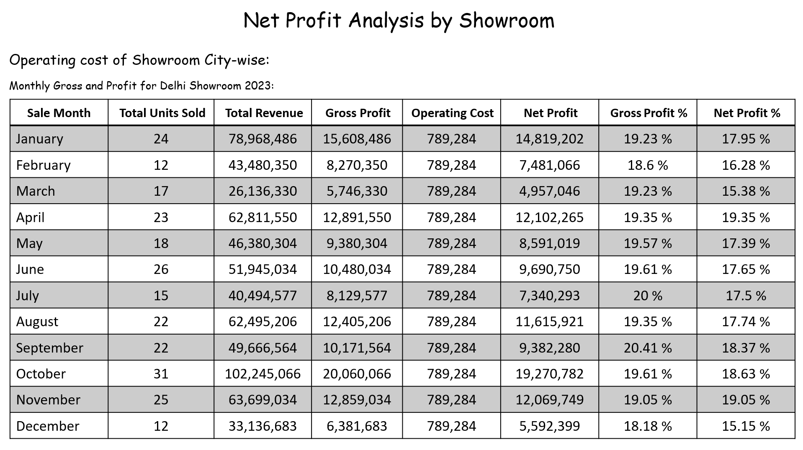
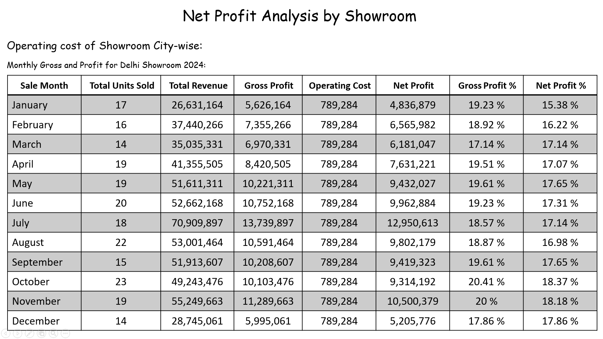
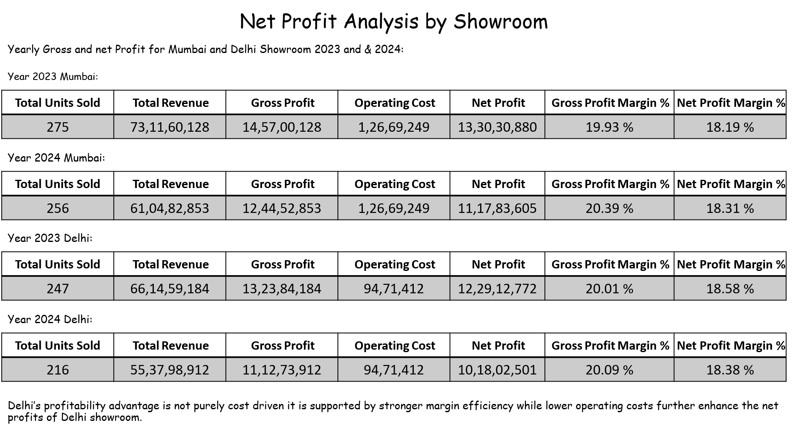

## Dataset Information

The dataset used in this project is synthetically generated and not represent real delarship transactions. The dataset was generated using python scripts with the assistance of Claude AI to simulate a realistic automobile delaership environment, including:

- Customer Information
- Vehicle Inventory
- Sales Transactions
- Finaning records
- Marketing Campgains
- Test Drives
- Service records
- Branch Operations

The dataset was designed to mimic real-world business scenarios and suppourt analytical tasks such as revenue analysis, profitability evalustion, margin analysis and branch expansion recommendations.

---

## Business Problem

Velocity Motors pvt limited is a multi-automobile delearship operating accross several cities offering brand new and certified used cars, finaing options and after sales services. Despite consistent growth in sales volume accross branches the management has observed siginifcant variation in profitability and operational efficieny. Some branches generate stong revenue but fail to convert it into profit while others demontrate better margin performance.

Senior leadership has initiated data driven performance review to understand the underlying drivers of these differences. The Objective is to evealuate branch level performance and identify key factors such as product mix, pricing and cost efficiency that influence both revenue and profitability. Additionally the company aims to identify which branches demontrate strong and sustainable performance and therefore suitable for expansion. 

The analysis aims to provide actionable insights to improve overall business performance and suppourt strategic decisions such as resource allocation and branch expansion.

### Key business questions:
- Why do some branches outperform others in profitability ?
- Does higher revenue translate into better margins ?
- How does product mix influence performance ?
- Where are the efficiency gaps accross branches ?
- Which branches are strong candidates for expansion based on performance and efficiency ?

Note: This project uses synthetic data generated through Python and Claude AI for educational and portfolio purposes.

---

## Tools Used
- MySQL
- Power Point
- Excel

---

## Concepts Used
- Joins
- Aggregations
- Case Statements
- CTE
- Window Functions
- Ranking Functions
---

## Key Findings

### Revenue Analysis
- Mumbai North Showroom generated the highest revenue.
- Premium vehicles contributed a major share of revenue.

### Profitability Analysis
- Delhi achieved higher gross margins.
- Delhi generated higher profit per vehicle.

### Operational Efficiency
- Delhi maintained lower operating costs.
- Delhi generated higher profir per vehicle.

### Expansion Recomendation

Delhi North Showroom is recommended branch for expansion due to:
- Higher profitablity efficiency.
- Lower Operating Costs.
- Better revenue to profit conversion.
- Stronger long term sustainability.

---

### Snapshots

#### Branch Revenue Comparison

#### Revenue Contribution %

.png)

### Premium vs Standard Vehicle revenue

### Gross Margin Comparison

### Net Profit Analysis Mumbai Showroom 2023 and 2024

### Net Profit Analysis Dehi Showroom 2023 and 2024

### Overall Summary of Net Profit Mumbai and Delhi Showroom for 2023 and 2024

