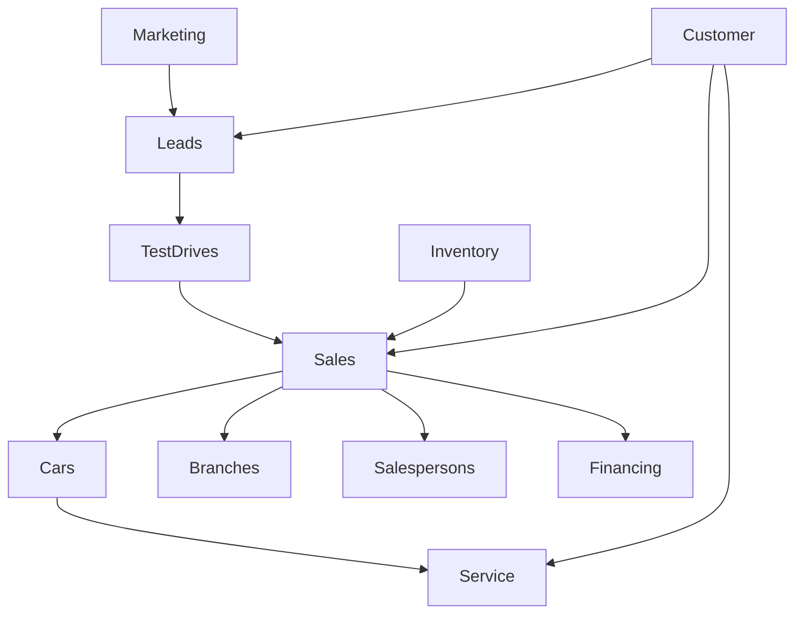
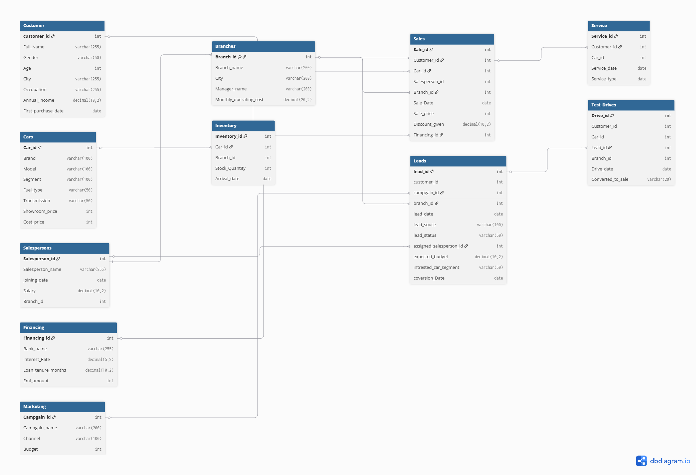

## Database Structure

### Tables Used

- Customer Table: Stores demographic and profile information of customers. This data is used for segmentation analysis, repeat customer analysis, CLV estimation, Identifying high value demographics.

- Cars Table: This is the master table for all the cars sold. This table is used for product performance analysis, brand/model profitability, segment demand trends.

- Sales Table: Transaction fact table containing all the sales. This is the core table for revenue/ profit and business analysis.

- Branches Table: Stores dealership branch details. This is used for branch table benchmarking, city-wise comparisons, operational efficiency view.

- Salespersons Table: Stores employee salesforce details. This table is used for performance ranking, incentive analysis, productivity benchmarking

- Inventory Table: Tracks stocks across branches. This table is used for stock aging, inventory turnover, overstock and understock detection.

- Financing Table: Tracks financing and loan packages. This is used for financing adoption analysis, bank preference comparison, loan preference trends.

- Servicing Table: Track post sale servicing. This table is used for retention analysis, after sales revenue, loyalty behavior.

- Marketing Campgain Table: Tracks lead generation campaigns. This table is used ROI calculation, Marketing effectiveness.

- Test Drive Table: Tracks showroom visits/ test drives. This table is used conversion funnel analysis, lead conversion optimization.

- Leads Table: The leads table captures every potential customer inquiry/prospect before they become buyers. This helps the management analyze: Lead Generation Volume, Campaign Effectiveness, Conversion funnel performance, Sales funnel leakage, Customer acquisition efficiency.

---

## Table Structure

### Customers Table

| Column | Description |
|----------|-------------|
| Customer_id | Unique customer identifier |
| Full_Name | Customer name |
| Gender | Gender of the customer |
| Age | Age of the customer |
| City | Residence city of the customer |
| Occupation | Job profile of customer |
| Annual_income | Income bracket of the customer |
| First_purchase_date | First ever purchase date |
## 

### Cars Table
| Column Name | Description |
|------------|-------------|
| Car_ID | Unique car identifier |
| Brand | Car manufacturer |
| Model | Car model |
| Segment | SUV, Sedan, Hatchback, Luxury |
| Fuel_Type | Petrol, Diesel, Electric |
| Transmission | Manual or Automatic |
| Showroom_Price | Listed showroom price |
| Cost_Price | Dealership acquisition cost |
##

### Sales Table

| Column Name | Description |
|------------|-------------|
| Sale_ID | Unique sales transaction ID |
| Customer_ID | Customer who purchased the vehicle |
| Car_ID | Vehicle sold |
| Salesperson_ID | Salesperson responsible for the sale |
| Branch_ID | Branch where the sale occurred |
| Sale_Date | Date of sale |
| Sale_Price | Final selling price |
| Discount_Given | Discount offered on the sale |
| Financing_ID | Financing package selected |
##

### Branches Table

| Column Name | Description |
|------------|-------------|
| Branch_ID | Unique branch identifier |
| Branch_Name | Name of the branch |
| City | Branch location |
| Manager_Name | Branch manager |
| Monthly_Operating_Cost | Monthly branch operating expenses |
##

### Salespersons Table

| Column Name | Description |
|------------|-------------|
| Salesperson_ID | Unique employee identifier |
| Salesperson_Name | Employee name |
| Joining_Date | Date of joining |
| Salary | Base salary |
| Branch_ID | Assigned branch |
##

### Inventory Table

| Column Name | Description |
|------------|-------------|
| Inventory_ID | Inventory record identifier |
| Car_ID | Vehicle identifier |
| Branch_ID | Branch holding the stock |
| Stock_Quantity | Available units |
| Arrival_Date | Date stock was received |

### Financing Table

| Column Name | Description |
|------------|-------------|
| Financing_ID | Loan package identifier |
| Bank_Name | Financing bank |
| Interest_Rate | Loan interest rate |
| Loan_Tenure_Months | Loan duration in months |
| EMI_Amount | Monthly EMI amount |
##

### Servicing Table

| Column Name | Description |
|------------|-------------|
| Service_ID | Service record identifier |
| Customer_ID | Vehicle owner |
| Car_ID | Serviced vehicle |
| Service_Date | Date of service |
| Service_Type | Repair or Maintenance |
##

### Marketing Campaign Table

| Column Name | Description |
|------------|-------------|
| Campaign_ID | Campaign identifier |
| Campaign_Name | Marketing initiative |
| Channel | Facebook, TV, Newspaper, etc. |
| Budget | Campaign spending |
##

### Test Drive Table

| Column Name | Description |
|------------|-------------|
| Drive_ID | Test drive identifier |
| Customer_ID | Prospect customer |
| Car_ID | Tested vehicle |
| Branch_ID | Branch location |
| Drive_Date | Test drive date |
| Converted_To_Sale | Yes / No indicator |
##

### Leads Table

| Column Name | Description |
|------------|-------------|
| Lead_ID | Unique lead identifier |
| Customer_ID | Associated prospect/customer |
| Campaign_ID | Marketing campaign source |
| Branch_ID | Branch handling the lead |
| Lead_Date | Date lead was generated |
| Lead_Source | Walk-in, Website, Facebook, Referral |
| Lead_Status | Open, Contacted, Qualified, Lost, Converted |
| Assigned_Salesperson_ID | Assigned salesperson |
| Expected_Budget | Prospect's expected budget |
| Interested_Car_Segment | SUV, Sedan, Hatchback, Luxury |
| Conversion_Date | Date lead converted into a sale |

## Database Relationships

The Velocity Motors database follows a relational model with **Sales** as the central transaction table connected to customers, vehicles, branches, salespersons, and financing information.

### Customer Relationships

| Parent Table | Child Table | Relationship |
|-------------|-------------|-------------|
| Customer | Sales | One customer can purchase multiple vehicles |
| Customer | Leads | One customer can generate multiple leads |
| Customer | Test_Drives | One customer can schedule multiple test drives |
| Customer | Service | One customer can have multiple service records |

**Relationship Type:** One-to-Many (1:N)

---

### Branch Relationships

| Parent Table | Child Table | Relationship |
|-------------|-------------|-------------|
| Branches | Sales | One branch can process many sales |
| Branches | Inventory | One branch can hold many vehicles in stock |
| Branches | Salespersons | One branch can employ multiple salespersons |
| Branches | Leads | One branch can receive multiple leads |
| Branches | Test_Drives | One branch can conduct multiple test drives |

**Relationship Type:** One-to-Many (1:N)

---

### Vehicle Relationships

| Parent Table | Child Table | Relationship |
|-------------|-------------|-------------|
| Cars | Sales | One vehicle model can be sold multiple times |
| Cars | Inventory | Vehicles are stocked across branches |
| Cars | Test_Drives | Vehicles can be used for multiple test drives |
| Cars | Service | Vehicles can have multiple service records |

**Relationship Type:** One-to-Many (1:N)

---

### Salesperson Relationships

| Parent Table | Child Table | Relationship |
|-------------|-------------|-------------|
| Salespersons | Sales | One salesperson can make multiple sales |
| Salespersons | Leads | One salesperson can manage multiple leads |

**Relationship Type:** One-to-Many (1:N)

---

### Marketing Relationships

| Parent Table | Child Table | Relationship |
|-------------|-------------|-------------|
| Marketing | Leads | One marketing campaign can generate multiple leads |

**Relationship Type:** One-to-Many (1:N)

---

### Financing Relationships

| Parent Table | Child Table | Relationship |
|-------------|-------------|-------------|
| Financing | Sales | One financing plan can be associated with multiple vehicle sales |

**Relationship Type:** One-to-Many (1:N)

---

## Database Workflow

The database is designed to simulate the complete customer journey within an automobile dealership, from lead generation to vehicle purchase and after-sales service.

### Workflow Overview

1. **Lead Generation**
   - Marketing campaigns generate potential customer leads.
   - Lead information is stored in the `Leads` table along with campaign details, expected budget, and customer preferences.

2. **Customer Engagement**
   - Interested customers schedule test drives for specific vehicle models.
   - Test drive activity is tracked through the `Test_Drives` table and linked to both customers and leads.

3. **Vehicle Sales**
   - When a customer decides to purchase a vehicle, a transaction is recorded in the `Sales` table.
   - Each sale is associated with:
     - A customer
     - A vehicle
     - A branch
     - A salesperson
     - Financing details (if applicable)

4. **Inventory Management**
   - Vehicle availability across branches is managed through the `Inventory` table.
   - Inventory records help track stock levels and vehicle movement between branches.

5. **Financing**
   - Customers may choose financing options offered by partner banks.
   - Financing information such as interest rates, EMI amounts, and loan tenure is stored in the `Financing` table.

6. **After-Sales Service**
   - Once a vehicle is sold, customers can avail maintenance and servicing.
   - Service history is recorded in the `Service` table and linked to both the customer and vehicle.

### DB Sturcture Snapshot

### Analytical Value

This relational database enables analysis across multiple business functions, including:

- Revenue and profitability analysis
- Branch performance comparison
- Vehicle segment analysis
- Inventory utilization
- Lead conversion effectiveness
- Salesperson performance evaluation
- Customer behavior analysis
- Expansion and operational efficiency assessment

